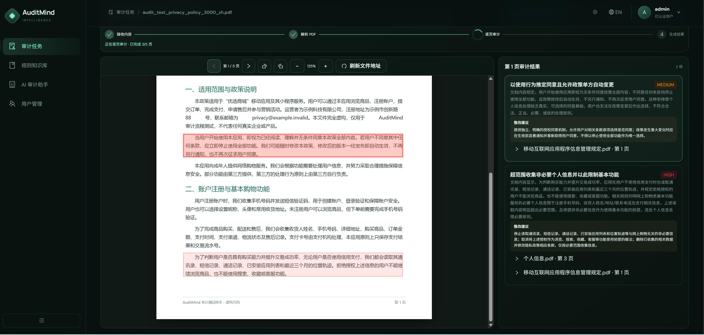
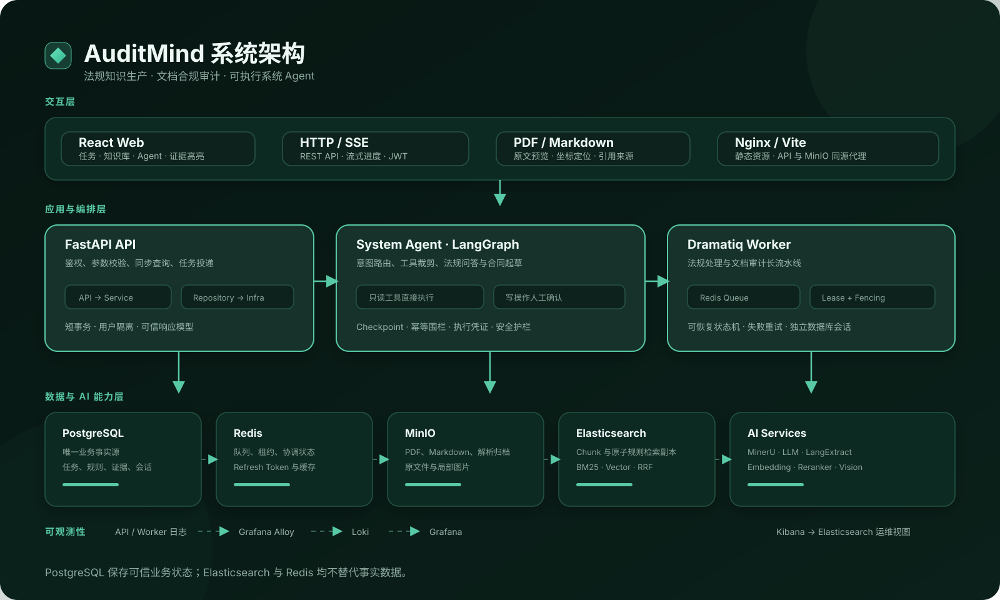

# AuditMind

> 面向法规知识管理与文档合规审计的 AI 原生工作台。

AuditMind 将法律法规、平台政策、行业标准、公司制度、合同及自定义知识转换为可检索的原文片段和结构化原子规则，并据此审计 PDF、Markdown 或纯文本。系统会在原文中定位风险证据，给出风险等级、问题说明、整改建议和可核验的法规来源。

<p align="center">
  
</p>

## 核心能力

| 能力 | 说明 |
| --- | --- |
| 规则知识库 | 上传 PDF 或录入 Markdown/纯文本，经过解析、切分、索引和 LangExtract 抽取后形成可追溯的原子规则。 |
| 文档合规审计 | 对 PDF、Markdown 和纯文本逐页或逐段审计，在原文中高亮证据，并展示风险等级、整改建议与法规依据。 |
| AI 审计助手 | 基于 LangGraph 的系统 Agent，可进行法规问答、法规检索、合同起草与审查，并读取系统中的法规、文档和审计结果。 |
| 可控系统操作 | Agent 可新增文本法规、处理法规、创建或重试审计任务；写操作需要用户确认，并通过幂等围栏和执行凭证防止重复副作用。 |
| 可信引用 | 模型只返回候选 ID，最终原文、坐标和法规来源由服务端从可信数据中补齐并验证。 |
| 异步可恢复流水线 | 法规处理和文档审计由 Dramatiq Worker 执行，使用 Redis 租约与数据库 fencing token 防止并发覆盖，失败阶段可重试。 |

## 系统架构

<p align="center">
  
</p>

系统遵循 `API → Service → Repository → Infrastructure` 的依赖方向：

- **React Web** 提供审计任务、规则知识库、AI 审计助手和原文证据高亮界面。
- **FastAPI** 负责鉴权、协议校验、同步查询、SSE 会话和后台任务投递。
- **System Agent** 根据意图裁剪工具；只读操作直接执行，写操作暂停并等待用户确认后从 Checkpoint 恢复。
- **Dramatiq Worker** 执行法规解析、知识索引、规则抽取和逐页审计等长任务。
- **PostgreSQL** 是唯一业务事实库；Elasticsearch 是可重建检索副本，Redis 用于队列、租约、缓存与临时协调。
- **MinIO** 保存原始文件和解析资源；MinerU、LLM、Embedding、Reranker 等服务提供文档理解和 AI 推理能力。

## 主要流程

### 法规知识生产

```text
上传 PDF / 录入文本
        ↓
MinerU 或 Markdown 解析
        ↓
语义切分与向量索引
        ↓
LangExtract 原子规则抽取
        ↓
原文定位校验与规则发布
```

### 文档合规审计

```text
上传待审计文档
        ↓
解析页面、区块与坐标
        ↓
召回有效候选规则
        ↓
LLM 逐页 / 逐段判断
        ↓
服务端核验并生成证据、发现和整改建议
```

## 技术栈

| 层级 | 技术 |
| --- | --- |
| 前端 | React 19、TypeScript、Vite、Ant Design、TanStack Router / Query、PDF.js |
| API 与业务 | Python 3.12、FastAPI、Pydantic、SQLAlchemy、Alembic |
| Agent 与 AI | LangGraph、LangChain、LangExtract、OpenAI 兼容模型、Embedding、Reranker |
| 异步任务 | Dramatiq、Redis、自动续租锁、乐观锁与 fencing token |
| 数据与存储 | PostgreSQL、Elasticsearch、MinIO、Redis |
| 文档解析 | MinerU，支持 PDF 版面、文本、表格、公式、图片和坐标解析 |
| 可观测性 | Grafana Alloy、Loki、Grafana、Kibana |

## 项目结构

```text
audit-mind/
├── server/                  # FastAPI、Worker、AI、数据库迁移与基础设施配置
│   ├── app/api/             # HTTP / SSE 接口
│   ├── app/services/        # 业务服务与长流程编排
│   ├── app/ai/agent/        # System Agent、工具、审批与 Checkpoint
│   ├── app/repositories/    # PostgreSQL 数据访问
│   ├── migrations/          # Alembic 数据库版本
│   └── README.md            # 完整启动和部署说明
├── web/                     # React 前端
└── docs/images/             # README 截图与架构图
```

## 启动与部署

环境准备、配置项、数据库初始化、本地启动、Worker、MinerU 以及生产部署说明，请参阅：

### [启动与部署](server/README.md)

## 安全说明

- 不要提交 `.env`、API Key、密码、上传文件或生产数据。
- 生产环境应通过 HTTPS 和同源反向代理提供服务，基础设施端口仅绑定可信网络。
- AI 输出用于辅助审计，重要结论应结合原始法规、证据位置和专业人员复核。
